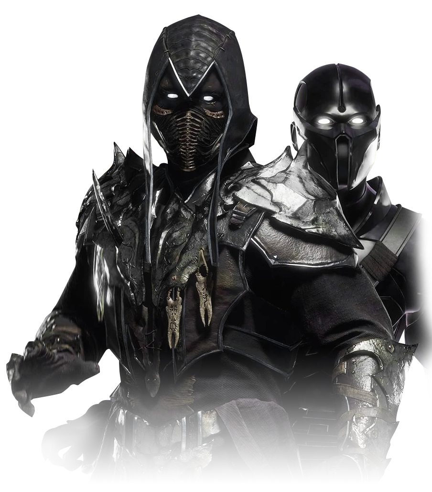
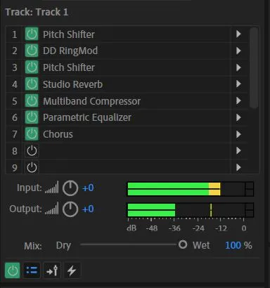

# Game audio: Noob Saibot recreation

I recreated the voice of Noob Saibot from Mortal Kombat 11 with my own voice. I added a pitch shiter, reverb, chorus, ring mod, multiband compression & an equalizer. I recreated it in Adobe Audition. 

Below is the original Noob Saibot voice & my recreated version.

Below is a screenshot of the effects that I applied to my voice to recreate the effect.

