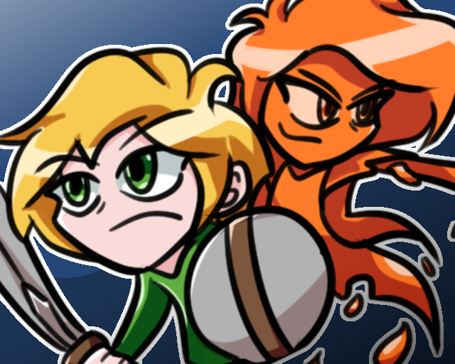
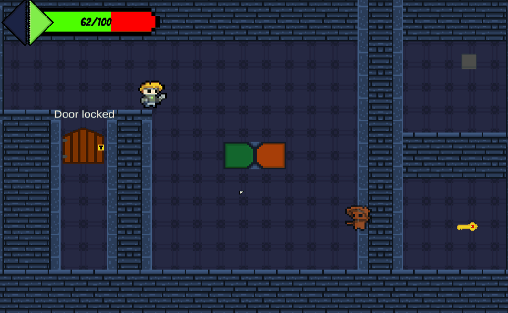

# GMTK ’21 Jam: Souls Reflection

I joined the Game Maker ToolKit 2021 gamejam with a group of friends and created a game within 2 days! The game we created is Souls Reflection.

Souls Reflection is a 2D Action Puzzle game about working together with your friend to solve puzzles, battle through monsters and to find a way out! 

You control 2 player characters at the same time, where one is a ghost that can move through walls. You can switch which character is the ghost. Both characters also have a unique attack, where one has a melee attack & the other shoots projectiles, but be careful where you're attacking! You can hit damage your friend instead of the enemies trying to stop you!

Though I helped with various aspects of the project, I was mostly worked on the following:
- Projectile collision detection
- Enviromental art
- Prop art

Feel free to play our game on this [link](https://zoranster.itch.io/souls-reflection). In the same link you can also check the the portfolios & other games my friends worked on.
