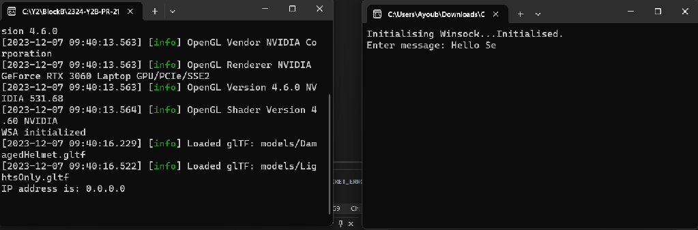
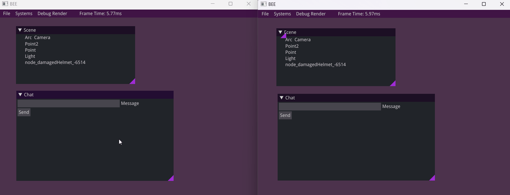
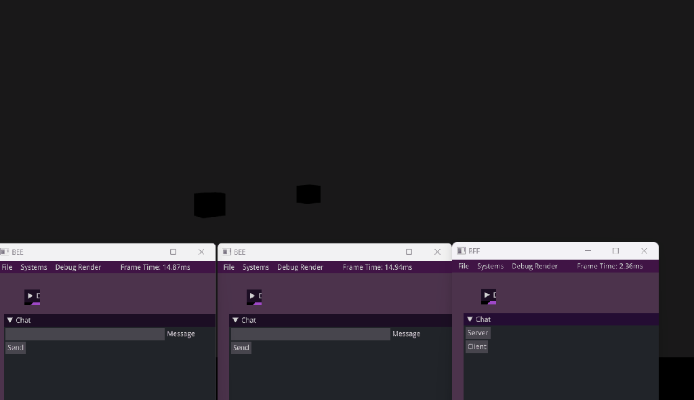
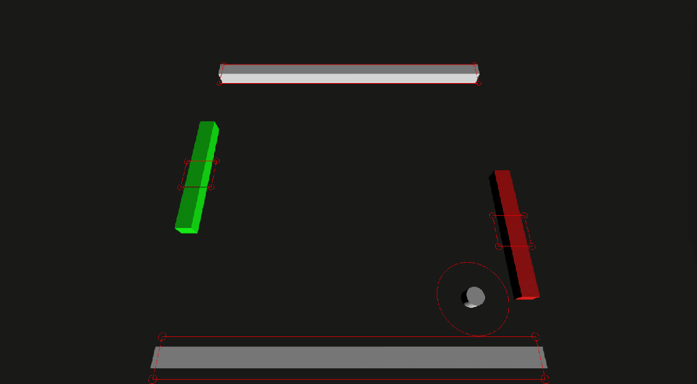

# Multiplayer networking: Sending/receiving data & API design

Hello! My name is Ayoub. I’m a 2nd year BUAS game developer student & for a while I’ve had an interest with multiplayer networking. Since that a big chunk of triple A games are online multiplayer games, it is in my that game developers should at least have an understanding how multiplayer games work.

For my school project, I decided to create a multiplayer game where players send messages to each other, move around in a lobby & players can play various minigames, all to learn how to create a multiplayer environment.

My ideas with this project were the following:

1. Get a better understanding how multiplayer games work.
2. Learn how to create a multiplayer framework.
3. Implement various mechanics/concepts to showcase what my framework can do.

Before starting the project, I had to make some design choices that dictates the framework.

# TCP or UDP?

The first choice that I had to make was what socket protocol I want to use: TCP or UDP. I decided to use UDP. Though TCP is more reliable with sending data & breaks down the data for you, it is slow & can even stall games to the point where it would be unplayable for the average user. Online multiplayer games are usually time-critical, in which you never want to use TCP. I want the data to be send as fast as possible. Though UDP is connectionless & unreliable, it is fast. I can mitigate those issues by implementing TCP features into my UDP implementation.

# P2P or Server-Client?

The second choice that I have to make is whether I want to use a peer-to-peer (P2P) or server-client network. With P2P, one client hast to act as a “server”, so the all the nodes are reliant to the network of that one node. If the network or system of the node is underperforming, it could cause latency issues or desynchronization. All peers are connected & are aware with each other, making the network a lot less secure & more vulnerable to exploits. In server-client, the server is authoritative, meaning that all clients need to connect & communicate with the server to gain the necessary data. This also makes the network more secure, since only the server is aware of all the connected client. Clients are not connected with each other. Clients are reliant to the server, however. If the server is down, nobody can play the game. In the end I chose server-client since it is more secure, synchronization more stable & that is the norm within the industry.

# The chat system

With my system design choices made, I can start with creating the multiplayer game. I started with creating a simple chat system. This gave me the opportunity to learn following things:

- How do I establish a connection between two sockets?
- How do I send data between sockets?
- With sending chat messages, how do I send one message to all clients connected to the server (a.k.a., how do I synchronize all clients with each other)?

First, I have to create a socket. Because I currently only want to run the project on my windows PC, I’m going to use Winsock for networking. This is also needed to use sockets.

First, I initialize Winsock.

```cpp
void InitWSA()
{
    WSADATA ws;

    // Initialize winsock
    if (WSAStartup(MAKEWORD(2, 2), &ws) != 0)
    {
        // WSAGetLastError returns errors when using Winsock & sockets

        printf("Failed. Error Code: %d", WSAGetLastError());

        return 1;
    }
}
```

With Winsock now initialized, I can now use sockets. When initializing sockets, you have to set up parameters such as the internet protocol we want to use & if the socket needs to be TCP or UDP.

```cpp
SOCKET udpSock;

void InitUDPSocket()
{
    // Sets the internet protocal to IPv4
    int internetProtocal = AF_INET;
    // Sets the socket type to datagrams
    int socketType = SOCK_DGRAM;
    // Sets the socket protocal to UDP
    int socketProtocal = IPPROTO_UDP;

    if ((udpSock = socket(internetProtocal, socketType, socketProtocal)) == SOCKET_ERROR)
    {
        printf("socket() failed with error code: %d", WSAGetLastError());
    }
}
```

When a packet is send to a socket, it is being send to a machine with an IP address & a specified port. For the server to receive packets from clients, the socket needs to be bound to a specified port & IP. sockaddr_in stores the IP address & port. The port I’ve chosen in this case is 8080, since ports below 1024 are already reserved.

```cpp
void InitUDPServer()
{
    // Sets the internet protocal to IPv4
    int internetProtocal = AF_INET;
    // Sets the socket type to datagrams
    int socketType = SOCK_DGRAM;
    // Sets the socket protocal to UDP
    int socketProtocal = IPPROTO_UDP;

    if ((udpSock = socket(internetProtocal, socketType, socketProtocal)) == SOCKET_ERROR)
    {
        printf("socket() failed with error code: %d", WSAGetLastError());
    }

    sockaddr_in serverSock;

    // Sets the internet protocal to IPv4
    serverSock.sin_family = AF_INET;
    // Let the system choose an IP
    serverSock.sin_addr.s_addr = INADDR_ANY;
    // Set the port the 8080
    serverSock.sin_port = htons(8080); 

    // Bind the socket to the port 
    if (bind(sockfd, (sockaddr*)&serverSock, sizeof(serverSock)) < 0 ) 
    {
        printf("bind() failed with error code: %d", WSAGetLastError());
    } 
}
```

With this setup, the socket can now send & receive data. For the client to send data, the client needs to call the sendto method with the data it wants to send & to the machine it wants to send the data to. I already know what the IP & the port is, so I can just fill the address & port of the server on intialization. With the server IP & port setup, I call the sendto method, fill the parameters with the data, size of the data & the server address & then the socket sends the data to the server.

```cpp
sockaddr_in server;

void InitUDPSocket()
{
    // Earlier created code...
    server.sin_family = AF_INET;
    server.sin_port = htons(PORT);
    server.sin_addr.S_un.S_addr = inet_addr("127.0.0.1");

}

void UpdateClient()
{
    while(true)
    {
        // Set the message packet with a set size
        char message[1024]= {};

        // Write the message in the console
        cin.getline(message, 1024);

        // Send the message to the server
        if (sendto(udpSock, message, 1024, 0, (sockaddr*)&server, sizeof(sockaddr_in)) == SOCKET_ERROR)
        {
            printf("sendto() failed with error code: %d", WSAGetLastError());
        }
    }
}
```

The client is now sending the data to the server, but the server isn’t currently receiving the data. This is because the server isn’t calling the recvfrom method. The recvfrom method checks if there is a packet to receive. If there is, it grabs the data. One of the parameters in the recvfrom requires a sockaddr_in variable. If a packet is received, it fills the variable with the IP from the machine that send the data. Otherwise it keeps waiting until a packet is received (unless we enable nonblocking mode). It is important that the length parameter is equal or bigger than the size of the packet that the socket receives. Of the packet is bigger, than it is being ignored.

```cpp
sockaddr_in client;

void UpdateServer()
{
    while(true)
    {
        // Set the message packet with a set size
        char packet[1024]= {};

        // Send the message to the server
        if (recvfrom(udpSock, packet, 1024, 0, (sockaddr*)&client, sizeof(sockaddr_in)) == SOCKET_ERROR)
        {
            printf("recvfrom() failed with error code: %d", WSAGetLastError());
        }
    }
}
```

The server is now receiving data from the client. Great! Now the server just needs to send the data back client. With the packet that the server received, I just send that packet back to the client. As mentioned before, the address & port in the client variable is being set by recvfrom. So now I just do the same thing I did on the client side to the server.

```cpp
sockaddr_in client;

void UpdateServer()
{
    while(true)
    {
        // Set the message packet with a set size
        char packet[1024]= {};

        // Receive a message from the client
        if (recvfrom(udpSock, packet, 1024, 0, (sockaddr*)&client, sizeof(sockaddr_in)) == SOCKET_ERROR)
        {
            printf("recvfrom() failed with error code: %d", WSAGetLastError());
        }

        // Send the received message to the client
        if (sendto(udpSock, packet, 1024, 0, (sockaddr*)&client, sizeof(sockaddr_in)) == SOCKET_ERROR)
        {
            printf("sendto() failed with error code: %d", WSAGetLastError());
        }
    }
}
```

And now on the client side, we call receive method.

```cpp
void UpdateClient()
{
    while(true)
    {
        // Set the message packet with a set size
        char message[1024]= {};

        // Write the message in the console
        cin.getline(message, 1024);

        // Send the message packet to the server
        if (sendto(udpSock, message, 1024, 0, (sockaddr*)&serverAddress, sizeof(sockaddr_in)) == SOCKET_ERROR)
        {
            printf("sendto() failed with error code: %d", WSAGetLastError());
        }

        char packet[1024]= {};

        // Receive a packet from the server
        if (recvfrom(udpSock, packet, 1024, 0, (sockaddr*)&serverAddress, sizeof(sockaddr_in)) == SOCKET_ERROR)

        {
            printf("recvfrom() failed with error code: %d", WSAGetLastError());
        }

        cout << packet << endl;

    }

}
```



Great! Now the server send data back client. However, it only sends it to one client. If multiple clients would connect to the server & send a message, the message would only be send to the one that send the message, not to all connected client. Since UDP is connectionless, I need to implement a way for the server to know what clients are connected to the server.

The server needs to know the IP & port of the users that are connected. I created a struct that simply holds the IP & port of a client.

```cpp
struct IPPoints
{
	uint32_t address;
	uint16_t port;
};
```

Whenever the server detects a new client, I want that the server saves the address & port.

We can’t just send the request to join the server in this current implementation, however. The server & client don’t know what kind of data is in the packet when receiving it, they only know that they received data. If one client would send a request to join the server, the server would handle the request data as if it were a chat message. I need to give the packets an ID so that the server (and client when the data is being send to it) knows what data is has received & how to handle it.

First, I created an enum to identify the packets.

```cpp
enum PacketType
{
	Join = 0,
	Message,
};
```

Now, before a packet is being send, I add the packet ID at the start of the buffer so that the recipient can handle it accordingly.

```cpp
int ID = 0;

void UpdateClient()
{
    while(true)
    {
        if(ID <= 0)
        {
            char packet[1]= {};

            PacketType type = PacketType::Join;

            char[0] = type;

            // Send the message to the server
            if (sendto(udpSock, packet, 1024, 0, (sockaddr*)&server, sizeof(sockaddr_in)) == SOCKET_ERROR)
            {
                printf("sendto() failed with error code: %d", WSAGetLastError());
            }

            char receivePacket[2] = {};

            // Receive a packet from the server
            if (recvfrom(udpSock, receivePacket, 2, 0, (sockaddr*)&serverAddress, sizeof(sockaddr_in)) == SOCKET_ERROR)
            {
                printf("recvfrom() failed with error code: %d", WSAGetLastError());
            }

            PacketType receiveType = receivePacket[0];

            if(receiveType == PacketType::Join)
            {
                ID = receivePacket[1];
            }
            else
            {
                cout << "packet type was not Join. Client failed to join." << endl;
            }
        }
        else
        {
            // Set the packet with a set size
            char sendPacket[1025]= {};

            PacketType type = PacketType::Message;

            sendPacket[0] = type;

            char message[1024] = {};

            // Write the message in the console
            cin.getline(message, 1024);

            // Add the message to the packet
            strcat(sendPacket, message);

            // Send the message to the server
            if (sendto(udpSock, sendPacket, 1025, 0, (sockaddr*)&server, sizeof(sockaddr_in)) == SOCKET_ERROR)
            {
                printf("sendto() failed with error code: %d", WSAGetLastError());
            }

            char receivePacket[1026] = {};

            // Receive a packet from the server
            if (recvfrom(udpSock, receivePacket, 1026, 0, (sockaddr*)&serverAddress, sizeof(sockaddr_in)) == SOCKET_ERROR)
            {
                printf("recvfrom() failed with error code: %d", WSAGetLastError());
            }

            PacketType receiveType = receivePacket[0];

            if(receiveType == PacketType::Message)
            {
                char[1024] receiveMessage = {};

                ID = receivePacket[1];

                // Set the data of the receiving packet into receiveMessage
                memcpy(receiveMessage, receivePacket + 2, 1024);

                cout << receiveMessage << endl;

            }

        }

    }

}
```

On the server side, before handling the whole packet, it first checks the type of ID before handling it.

```cpp
int nextID = 1;

vector<IPPoints> connectedPoints;

void UpdateServer()
{
    while(true)
    {
        // Set the receive packet with a set size
        char receivePacket[1025]= {};

        // Receive packet from the client
        if (recvfrom(udpSock, receivePacket, 1024, 0, (sockaddr*)&client, sizeof(sockaddr_in)) == SOCKET_ERROR)
        {
            printf("recvfrom() failed with error code: %d", WSAGetLastError());

        }

        // Check what type of data the received packet is
        PacketType receiveType = receivePacket[0];

        // Handle the data based on the packet type
        switch(receiveType)
        {
            case PacketType::Join:
            {
                char sendPacket[2] = {};

                PacketType sendType = PacketType::Join;

                sendPacket[0] = type;
                sendPacket[1] = nextID;

                if (sendto(udpSock, sendPacket, 2, 0, (sockaddr*)&client, sizeof(sockaddr_in)) == SOCKET_ERROR)
                {
                    printf("sendto() failed with error code: %d", WSAGetLastError());
                }

                IPPoint newPoint;

                newPoint.address = client.sin_addr.S_un.S_addr;
                newPoint.port = client.sin_port;

                connectedPoints.push_back(newPoint);

                nextID += 1;

                break;

            }

            case PacketType::Message:
            {
                char receivedMessage[1025] = {};

                memcpy(receivedMessage, receivedPacket, 1025);

                // Loop through all the connected points
                for(int i = 0; i < connectedPoints.size(); i++)
                {
                    // set a temp sockaddr_in to fill the address of the current IP point
                    sockaddr_in address;

                    address.sin_family = AF_INET;
                    // Set the address to the current IP point in the loop
                    address.sin_addr.S_un.S_addr = connectedPoints[i].address;
                    address.sin_port = connectedPoints[i].port;

                    // Send the received message to the client
                    if (sendto(udpSock, receivedMessage, 1025, 0, (sockaddr*)&address, sizeof(sockaddr_in)) == SOCKET_ERROR)
                    {
                        printf("sendto() failed with error code: %d", WSAGetLastError());
                    }
                }

                break;
            }
        }
    }
}
```

Now, whenever a client is sending a message to the server, the server sends the message to all the connected clients! With the basics, I can continue & expand this project by creating more features.



# Outputstream

But before continuing, I decided to take a step back & look at my project. Looking at my code, calculating the size of the buffer & adding data into the buffer is a bit tedious. I have to manually calculate if the added data isn’t overloading the buffer. Plus, with my current implementation I practically have to copy paste memcpy to get the data.

To resolve this, I created the OutputBufferStream class. The class holds a buffer where I can put the data I want to send to other sockets. It also holds the size of the of the buffer, which increases based on the data that is being added to the buffer.

```cpp
OutputMemoryStream::OutputMemoryStream() : m_Buffer(nullptr), m_Head(0), m_Capacity(0)
{
}

const char* OutputMemoryStream::GetBufferPointer() const
{
	return m_Buffer;
}

uint32_t OutputMemoryStream::GetLength() const
{
	return m_Head;
}

void OutputMemoryStream::Write(const void* data, size_t byteCount)
{
	uint32_t result = m_Head + static_cast<uint32_t>(byteCount);

	// Checks if the result is bigger than the current capacity. If it is, reallocate the buffer
	if(result > m_Capacity)
	{
		// Max: Returns the greater result based on the parameters
		ReallocateBuffer(max(m_Capacity * 2, result));
	}

	// Set the data into the buffer
	memcpy(m_Buffer + m_Head, data, byteCount);

	// Updates the head to the result
	m_Head = result;
}

void OutputMemoryStream::ReallocateBuffer(uint32_t newLength)
{
	// Reallocates the buffer to a new size
	char* temp = static_cast<char*>(realloc(m_Buffer, newLength));

	if(temp != NULL)
	{
		m_Buffer = temp;
	}

	// Set updated capacity to newLength
	m_Capacity = newLength;
}
```

Using this class, all I have to do is just call the Read method, add the data I want to add in the buffer to the parameter & let the class fill the data into the buffer.

```cpp
void UpdateServer()
{
    int socketSize = sizeof(sockaddr_in);

    char receiveBuff[2048];

    int size = sizeof(receiveBuff);

    int byteSize = recvfrom(udpSock, receiveBuff, size, 0, (sockaddr*)&client, &socketSize);

    if (byteSize > 0)
    {
        PacketType packetType = {};

        memcpy(&packetType, &receiveBuff[0], 1);

        switch(packetType)
        {
            // Code...

            case PacketType::Message:
            {

                char str[2048] = {};

                memcpy(str, receiveBuff + 1, 2048);

                string message(str);

                PacketType packetType = PacketType::Message;

                // Initialize the output stream
                OutputMemoryStream stream;

                // Add the packet type to the stream
                stream.Write(&packetType, sizeof(PacketType));
                // Add themessage to the stream
                stream.Write(&message.c_str(), sizeof(string));

                sockaddr_in sock;
                sock.sin_family = AF_INET;
                // Ideally this should be done in the end
                for (int i = 0; i < m_AllClients.size(); i++)
                {
                    sock.sin_addr.S_un.S_addr = m_AllClients[i].address;
                    sock.sin_port = m_AllClients[i].port;

                    // In the parameters, return the stream buffer & length
                    if (sendto(m_ServerSocket->m_Socket, stream.GetBufferPointer(), stream.GetLength(), 0, (sockaddr*)&sock, s) == SOCKET_ERROR)
                    {
                        SocketUtil::ReportError("TCPSocket::Receive");
                    }
                }

                break;
            }
            // Code...
        }
    }
}
```

# InputStream

For the input, I created a class called InputBufferStream, which is specifically made to read data. Just like the OuptutMemoryStream class, it holds the buffer data. Unlike it, however, it keeps track on the data that has been read. When reading the data, it is important that you read it in the order that the buffer is set, otherwise you’re going to get wrong/corrupted results.

```cpp
InputMemoryStream::InputMemoryStream(char* buffer, uint32_t byteCount) : m_Buffer(buffer), m_Capacity(byteCount), m_Head(0)
{
}

void InputMemoryStream::Read(void* data, uint32_t byteCount)
{
	uint32_t result = m_Head + byteCount;

	// Fill the data with the correct byte size from the buffer
	memcpy(data, m_Buffer + m_Head, byteCount);

	// Update the head with the new result
	m_Head = result;

}

uint32_t InputMemoryStream::GetRemainingDataSize() const
{
	// Returns the remaining data from the buffer
	return m_Capacity - m_Head;
}
```

```cpp
void UpdateClient()
{
    int byteSize = recvfrom(udpSock, receiveBuff, size, 0, (sockaddr*)&client, &socketSize);

    if (byteSize > 0)
    {
        PacketType packetType = {};

        // Set the buffer into the stream with it's size
        InputMemoryStream stream(packet, size);

        // Read what tye of packet the data is
        stream.Read(&packetType, sizeof(PacketType));

        switch(packetType)
        {
            // Code...
            case PacketType::Message:
            {
                char message[2048] = {};

                // Read & set the string
                stream.Read(&message, sizeof(string));
               
                string messageString(message);
                m_Messages.push_back(messageString);

                break;
            }

            // Code...
        }
    }
    // Code...
}
```

# SocketUtility & UDPSocket

I’ve also created a socket utility script to simplify creating sockets, handling/reporting errors & initializing & closing winsock.

```cpp
enum SocketAddressFamily
{
	INET = AF_INET,
	INET6 = AF_INET6
};


bool SocketUtil::StaticInit()
{
	WSADATA data;

        // Initialize winsock
	int result = WSAStartup(MAKEWORD(2, 2), &data);

	if (result != NO_ERROR)
	{
		ReportError("Starting Up");

		return false;
	}

	return true;
}

void SocketUtil::CleanUp()
{
	WSACleanup();
}

void SocketUtil::ReportError(const char* description)
{
	LPVOID lpMesssageBuffer;

	DWORD errorNummer = GetLastError();

	FormatMessage(
		FORMAT_MESSAGE_ALLOCATE_BUFFER |
		FORMAT_MESSAGE_FROM_SYSTEM |
		FORMAT_MESSAGE_IGNORE_INSERTS,
		NULL,
		errorNummer,
		MAKELANGID(LANG_NEUTRAL, SUBLANG_DEFAULT),
		(LPTSTR)&lpMesssageBuffer,
		0, NULL);

	LOG("Error %s: %d- %s", description, errorNummer, lpMesssageBuffer);
}

int SocketUtil::GetLastError()
{
	return WSAGetLastError();
}

UDPSocketPtr SocketUtil::CreateUDPSocket(SocketAddressFamily family)
{
	SOCKET s = socket(family, SOCK_DGRAM, IPPROTO_UDP);

	if (s != INVALID_SOCKET)
	{
		return UDPSocketPtr(new UDPSocket(s));
	}
	else
	{
		ReportError("SocketUtil::CreateUDPSocket");

		return nullptr;
	}
}
```

I also created a UDP socket class to make it easier to create a sock, bind & set it to non-blocking if desired. It utilizes the socket utility to report errors when something goes wrong.

```cpp
//TODO: Create send & receive methods
UDPSocket::UDPSocket(SOCKET socket) : m_Socket(socket) 
{
}

UDPSocket::~UDPSocket()
{
	closesocket(m_Socket);
}

// Binds the socket to the IP address
int UDPSocket::Bind(const SocketAddress& address)
{
	int error = bind(m_Socket, &address.m_SocketAddress, address.GetSize());

        // Report an error when binding the socket fails
	if (error != 0)
	{
		SocketUtil::ReportError("TCPSocket::Bind");
		return -SocketUtil::GetLastError();
	}

	char str[INET_ADDRSTRLEN];

	printf("IP address is: %s\n", inet_ntop(AF_INET, &address.GetSocketAddressIn()->sin_addr, str, INET_ADDRSTRLEN));

	return NO_ERROR;
}


int UDPSocket::SetNonBlockingMode(bool shouldBeNonBlocking)
{
	// Checks if the boolean is true. If it isn't set arg to 0
	u_long arg = shouldBeNonBlocking ? 1 : 0;

	int result = ioctlsocket(m_Socket, FIONBIO, &arg);

	// Checks if the result is an error. If it isn't return that there is no error.
	if (result == SOCKET_ERROR)
	{
		SocketUtil::ReportError("UDPSocket::SetNonBlockingMode");
		return SocketUtil::GetLastError();
	}
	else
	{
		return NO_ERROR;
	}

	return NO_ERROR;
}
```

To showcase an example, the code snippet below showcases an example where an socket is being created & bound to.

```cpp
void NetworkServerManager::InitServer(char* ip, uint16_t port)
{

       if (!SocketUtil::StaticInit())

        {

              cout << "Error initializing socket utilility" << endl;
        }

        else

              cout << "WSA initialized" << endl;


	// Create & open a UDP socket
	m_ServerSocket = SocketUtil::CreateUDPSocket(INET);

	// Set server to non-blocking to prevent server from getting stck
	m_ServerSocket->SetNonBlockingMode(true);

	// Assign an address & port to socket & bind it
	SocketAddress address(ip, port);

	// Bind the port to the socket
	m_ServerSocket->Bind(address);

	if (m_ServerSocket == nullptr)
		cout << "No socket" << endl;
}
```

With all of this setup, this makes it easier to create extra features. For example, a lobby where players can move around.



Or even a (mini)game such as pong!



Network programming is… not easy, but I’ve most definitely enjoyed it. In the future I’m going to expand my knowledge with networking, researching concepts such as rollback netcode, input prediction & anti-cheat such as input-validation.
