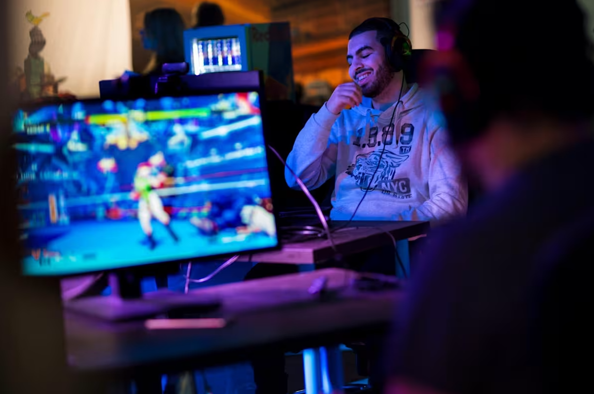

---
# the default layout is 'page'
icon: fas fa-info-circle
order: 4
---

 <H1>ABOUT ME</H1>

 <H3>All I want to do is to create awesome games</H3>

Greetings! My name is **Ayoub** & I'm a **software developer** specialised in **game development**. Currently, I'm studying at Breda Universities of Applied Sciences.

I have been a fan of games since I my childhood. From playing Spyro 3 on the original playstayion to playing Street Fighter V on a competitive level. In my opinion, video games can be used for almost anything, from a great story telling tool, to a excellent learning source, to even a form of sport (esports).

I've been programming for over 7 years. My main programming languages are C++ & C. I'm experienced with Unreal Engine, Unity & have worked on custom engines. I'm specialised in gameplay & tools programming.

I've worked on various project, from game-jams with some of my friends to solo projects to experimenting with creating my own tweening library or developing my own fighting game! Currently, I'm working on a group project as the programming lead on the game **Katharsi**.

As of now, I'm currently searching for an internship that grants me the opportunity to grant me first-hand experience to create games for people all-around the world!

 <H3>Skills</H3>

| Soft skills | Hard skills |
| :--------: | :-------: |
| Communication | C++ |
| Teamwork | C# |
| Leadership | Unreal Engine |
| Critical Thinking | Unity |
| Empathy | Dutch |
| Adaptability | English |
|  | Git |
|  | Perforce |
|  | Jira |
|  | Codecks |

